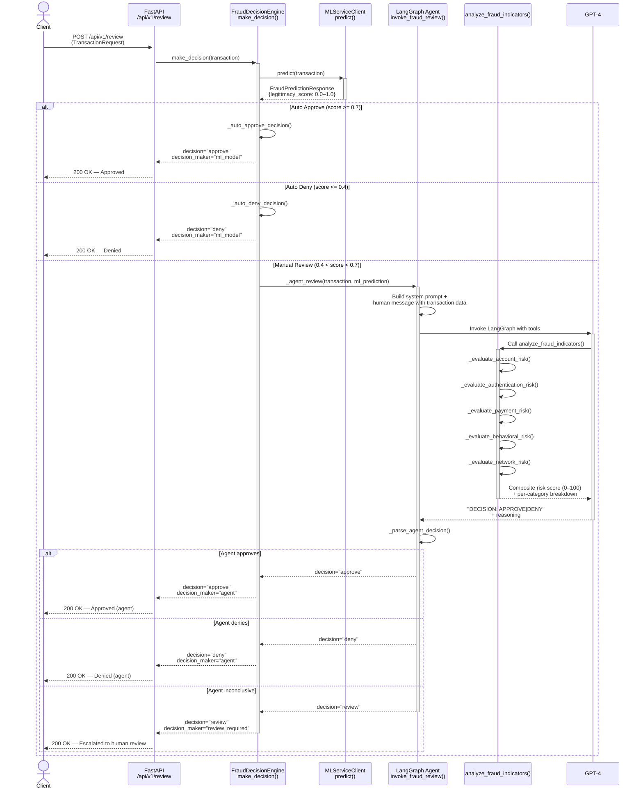

# Fraud Review Endpoint - Sequence Diagram

## Decision Thresholds

| ML Legitimacy Score | Path            | Decision Maker     |
|--------------------:|:----------------|:-------------------|
| **>= 0.7**         | Auto Approve    | `ml_model`         |
| **0.4 – 0.7**      | Agent Review    | `agent` or `review_required` |
| **<= 0.4**         | Auto Deny       | `ml_model`         |

## Agent Risk Analysis Categories

When the ML score falls in the uncertain range, the LangGraph agent calls `analyze_fraud_indicators()` which evaluates five risk categories:

| Category           | Key Signals                                              |
|:-------------------|:---------------------------------------------------------|
| Account Risk       | Account age, order amount, verification status           |
| Authentication Risk| Failed logins, password resets, new device/location      |
| Payment Risk       | CVV/AVS results, billing/shipping mismatch               |
| Behavioral Risk    | Transaction velocity, order amount vs average            |
| Network Risk       | VPN/proxy detection, IP country mismatches               |

The composite risk score (0–100) guides the agent's final decision:
- **< 30** → Recommend APPROVE
- **30–49** → Needs careful review
- **>= 50** → Recommend DENY
